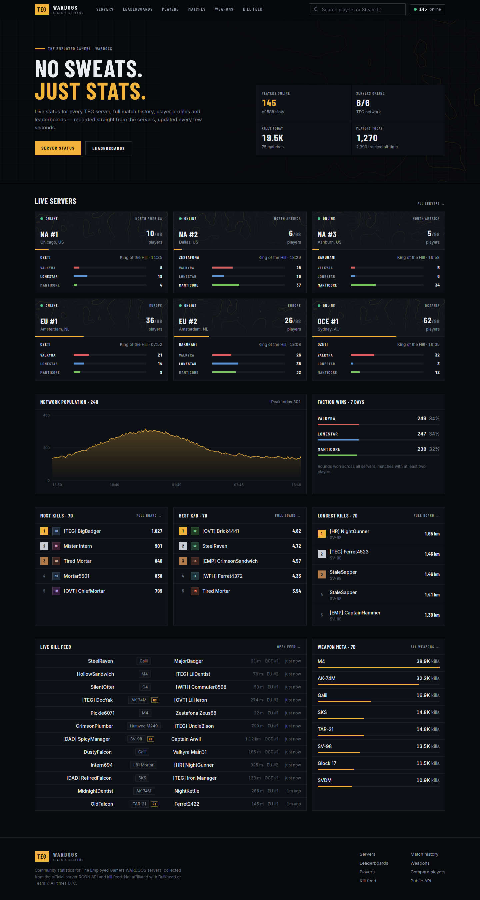
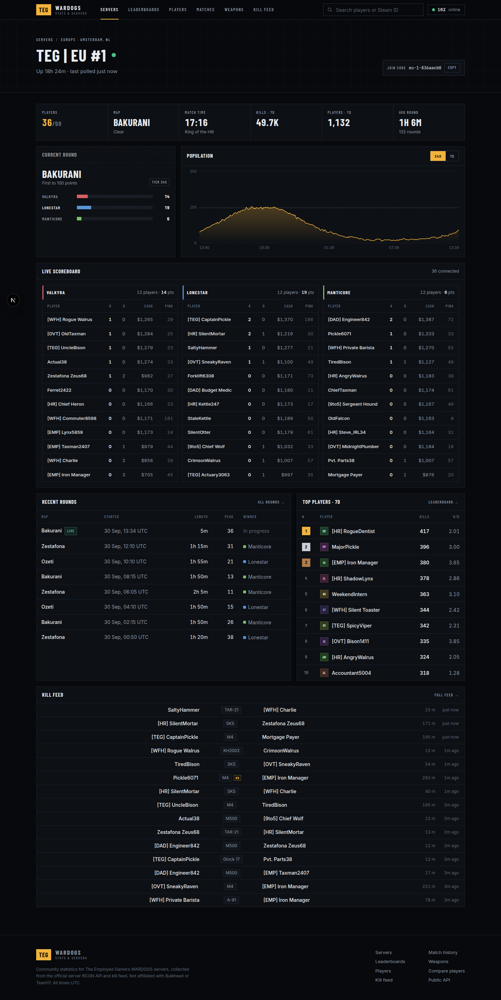
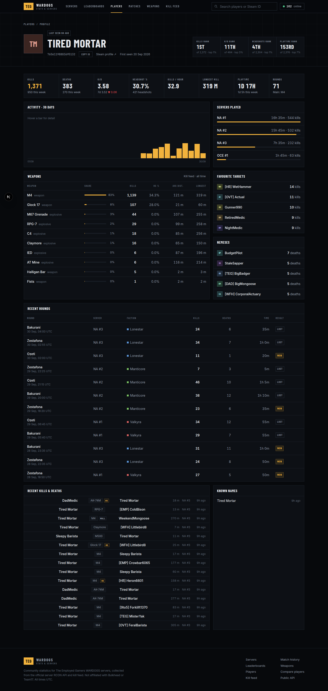

# TEG WARDOGS Stats

Server status, player profiles, match history and leaderboards for The Employed Gamers' WARDOGS
servers.

All data comes from TEG's Warcon panel, read through its keyed API with a View-only key. The site
has no database of its own; it keeps a short in-memory cache and shows what Warcon reports.

**Deploying?** [docs/DEPLOYMENT.md](docs/DEPLOYMENT.md) covers the VPS, the Cloudflare tunnel and
automatic deploys, step by step.



<p>
  
  
</p>

## Local development

Requires Node 22+.

```sh
npm install
cp .env.example .env     # points at the mock Warcon on :4100
npm run dev:mock         # mock Warcon plus next dev, http://localhost:3000
```

To develop against a real Warcon instead, set `WARCON_BASE_URL` and `WARCON_TOKEN` in `.env` and run
`npm run dev`. `npm run doctor` checks the key and every endpoint the site uses.

### Environment

| Variable | Default | |
| --- | --- | --- |
| `WARCON_BASE_URL` | none | Where Warcon answers, e.g. `http://warcon:3000` on the VPS |
| `WARCON_TOKEN` | none | Warcon org API key, View capability only |
| `SITE_URL` | none | Public origin, used in link previews |
| `SERVER_IDS` | all | Optional Warcon server ids to show, in order |
| `ALLOW_INDEXING` | `false` | `true` lets search engines index the site |

## Checks

```sh
npm test
npm run lint
npm run typecheck
```

Colour tokens live in `src/app/globals.css`.

Not affiliated with Bulkhead or Team17.
